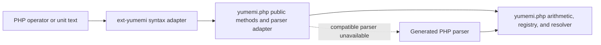
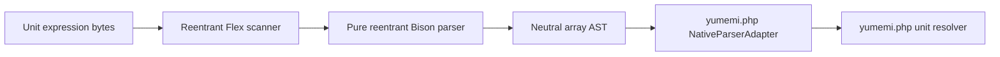

# Architecture

php-yumemi adds optional syntax to [yumemi.php](https://github.com/jbboehr/yumemi.php). Unit arithmetic stays in
yumemi.php.

## Component boundary

yumemi.php handles:

- exact arithmetic and conversion.
- unit and registry-context rules.
- AST interpretation, normalization, and simplification.
- operand validation and exception types.
- construction of `Quantity` and other result objects.

The extension handles:

- registration of the internal `jbboehr\Yumemi\InternalQuantity` base.
- Zend object handlers that delegate supported operators to public methods.
- tokenization and syntax parsing of unit-expression text.
- a neutral parser result that yumemi.php can validate and translate.

Portable code must work without the extension. Method-based arithmetic and the generated PHP parser are permanent
parts of yumemi.php, not temporary fallbacks.

## Optional quantity base

yumemi.php supplies a userland fallback named `jbboehr\Yumemi\InternalQuantity`. When the native extension is loaded
before Composer's autoloader, its internal class with the same name already exists and Composer does not load the
fallback file. yumemi.php's public `Quantity` class extends whichever base is present.

The internal base is abstract and declares no arithmetic methods. Descendants provide the public methods, signatures,
validation, and results. This keeps extension-defined signatures out of the pure-PHP package while the integration is
experimental.

The extension installs one object-handler table on descendants without changing normal userland allocation or object
behavior. Tests cover:

- declared and readonly properties.
- cloning and the custom handler table.
- compound-assignment aliasing.
- exception propagation.
- garbage collection for cyclic graphs.

## Operator delegation

The `do_operation` handler maps Zend opcodes to userland methods:

| PHP operator | Zend opcode | Userland method |
| --- | --- | --- |
| `+` | `ZEND_ADD` | `add()` |
| `-` | `ZEND_SUB` | `sub()` |
| `*` | `ZEND_MUL` | `mul()` |
| `/` | `ZEND_DIV` | `div()` |
| `**` | `ZEND_POW` | `pow()` |
| unary `+` | `ZEND_MUL` with `1` | `mul()` |
| unary `-` | `ZEND_MUL` with `-1` | `mul()` |

When a quantity is the right operand of `ZEND_DIV`, the handler calls `rdiv()` on that quantity and passes the left
operand as the numerator. Each userland method receives the other operand unchanged and decides which types it accepts,
what it returns, and which exceptions it throws.

Unsupported opcodes return `FAILURE`, leaving PHP's normal error behavior in place. On PHP 8.2 through 8.5, Zend lowers
unary signs through multiplication, so they use the same handler path without a separate unary callback. Binary
scalar-left `+`, `-`, and `**` are unsupported. Scalar multiplication delegates to the quantity from either side.

### Multiplication receiver contract

PHP may swap `ZEND_MUL` operands before invoking object handlers. A literal scalar and a quantity can arrive in the same
order for both `$quantity * 2` and `2 * $quantity`. The extension treats scalar multiplication as
commutative, which gives both expressions the same method call.

Zend can also reorder two quantity operands when variables and temporary expressions are mixed. The extension cannot
always recover the source-level left receiver, so yumemi.php defines multiplication without relying on that identity.
Its integration matrix compares operator syntax with method calls across reversed operands, variables,
temporary expressions, compound assignment, symbolic-factor order, and registry contexts. Accepted products are
canonical and retain the shared context. Rejected cross-context products expose the same exception from either order.

### Why comparisons use methods

The extension does not install a Zend `compare` handler. `zend_object_compare_t` receives two operands but no source
opcode or reason for the comparison. One callback would define the relation for every non-strict comparison operator
and for implicit comparisons in functions such as `sort()`, `min()`, and `max()`.

Yumemi quantity comparison is a partial natural order: `compareTo()` throws for incompatible dimensions or registry
contexts. A native handler would make implicit comparisons throw too. PHP also compiles `>` and `>=` as swapped `<` and
`<=` operations. The current operator contract does not include either behavior. Without a native handler, non-strict
operators compare PHP object state. They are not quantity comparisons and may disagree with the named methods for
equivalent values expressed in different units. Applications should use yumemi.php's named comparison methods. `===`
and `!==` keep their non-overloadable object-identity meaning.

## Native syntax path

The native lexer and parser remain syntax-only:

The scanner is length-aware and records zero-based, half-open byte spans. Its Unicode character classes are committed
as static tables generated from the PCRE version recorded by `NativeLexer::UNICODE_PCRE_VERSION`. The extension uses
that snapshot on every runtime instead of disabling native parsing when PHP reports a different PCRE version. The
parser allocates a neutral AST in a request-local arena and performs no unit lookup.

yumemi.php uses this path only through the versioned, fail-closed interface described in
[Native Parser ABI](NATIVE_PARSER_ABI.md). The current adapter makes the ABI decision with
`NativeParser::supports(1)`. Missing, disabled, older, or future-ABI extensions use the generated PHP parser.
`ABI_VERSION` and the always-true `isCompatible()` hook remain available for older adapters. Resource limits apply
before semantic resolution in both paths.

## Public and internal surfaces

The PHP extension and module are named `yumemi`, producing Composer's `ext-yumemi` platform package. The following PHP
classes are internal integration interfaces rather than application APIs:

- `jbboehr\Yumemi\InternalQuantity`.
- `jbboehr\Yumemi\Parser\NativeLexer`.
- `jbboehr\Yumemi\Parser\NativeParser`.
- `jbboehr\Yumemi\Parser\NativeLimitException`.
- `jbboehr\Yumemi\Parser\NativeParseException`.

Applications should use yumemi.php's public classes and methods. Only compatible yumemi.php adapters should access the
parser classes. The quantity base supplies Zend handlers to the public descendant.
