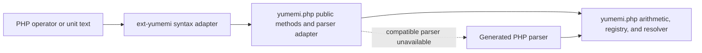

# Architecture

php-yumemi is an optional syntax adapter for [yumemi.php](https://github.com/jbboehr/yumemi.php). It deliberately does
not implement unit arithmetic or become a second semantic backend.

## Component boundary

yumemi.php remains authoritative for:

- exact arithmetic and conversion;
- unit and registry-context rules;
- AST interpretation, normalization, and simplification;
- operand validation and exception types; and
- construction of `Quantity` and other result objects.

The extension owns only:

- registration of the internal `jbboehr\Yumemi\InternalQuantity` base;
- Zend object handlers that delegate supported operators to public methods;
- tokenization and syntax parsing of unit-expression text; and
- a neutral parser result that yumemi.php can validate and translate.

Portable code must remain functional without the extension. Method-based quantity arithmetic and the generated PHP
parser are therefore permanent boundaries, not compatibility shims scheduled for removal.

## Optional quantity base

yumemi.php supplies a userland fallback named `jbboehr\Yumemi\InternalQuantity`. When the native extension is loaded
before Composer's autoloader, its internal class with the same name already exists and Composer does not load the
fallback file. yumemi.php's public `Quantity` class extends whichever base is present.

The internal base is abstract and intentionally declares no arithmetic methods. Its descendants supply the public
methods, signatures, validation, and results. This avoids imposing extension-defined signature variance on the
pure-PHP package while the integration remains experimental.

The extension installs one object-handler table on descendants. It preserves ordinary userland allocation and object
semantics, including:

- declared and readonly properties;
- cloning and the custom handler table;
- compound-assignment aliasing;
- exception propagation; and
- garbage collection for cyclic graphs.

## Operator delegation

The `do_operation` handler maps Zend opcodes to userland methods:

| PHP operator | Zend opcode | Userland method |
| --- | --- | --- |
| `+` | `ZEND_ADD` | `add()` |
| `-` | `ZEND_SUB` | `sub()` |
| `*` | `ZEND_MUL` | `mul()` |
| `/` | `ZEND_DIV` | `div()` |
| `**` | `ZEND_POW` | `pow()` |

When a quantity is the right operand of `ZEND_DIV`, the handler instead calls `rdiv()` on that quantity and forwards
the left operand as the numerator. For every delegated operation, the userland method receives the other operand
unchanged and owns its accepted types, result, and exceptions.

Unsupported opcodes return `FAILURE`, allowing PHP to retain its normal error behavior. Scalar-left `+`, `-`, and `**`
are deliberately unsupported. Scalar multiplication delegates to the quantity from either side.

### Multiplication receiver contract

PHP may swap `ZEND_MUL` operands before invoking object handlers. A literal scalar and a quantity can therefore arrive
in the same order for both `$quantity * 2` and `2 * $quantity`. The extension treats scalar multiplication as
commutative, which gives both expressions the same method call.

Zend can also reorder two quantity operands when variables and temporary expressions are mixed. The extension cannot
universally reconstruct the source-level left receiver, so yumemi.php defines multiplication without relying on that
identity. Its integration matrix compares operator syntax with method calls across reversed operands, variables,
temporary expressions, compound assignment, symbolic-factor order, and registry contexts. Accepted products are
canonical and retain the shared context; rejected cross-context products expose the same exception from either order.

## Native syntax path

The native lexer and parser remain syntax-only:

The scanner is length-aware and records zero-based, half-open byte spans. Unicode character classes are generated from
pinned data and guarded against PHP's runtime PCRE version. The parser allocates a neutral AST in a request-local arena
and performs no unit lookup.

yumemi.php admits this path only through the versioned, fail-closed interface described in
[Native Parser ABI](NATIVE_PARSER_ABI.md). Missing, disabled, incompatible, or future-ABI extensions use the generated
PHP parser. Resource limits apply before semantic resolution in both paths.

## Public and internal surfaces

The PHP extension and module are named `yumemi`, producing Composer's `ext-yumemi` platform package. The following PHP
classes are integration seams rather than application APIs:

- `jbboehr\Yumemi\InternalQuantity`;
- `jbboehr\Yumemi\Parser\NativeLexer`;
- `jbboehr\Yumemi\Parser\NativeParser`;
- `jbboehr\Yumemi\Parser\NativeLimitException`; and
- `jbboehr\Yumemi\Parser\NativeParseException`.

Applications should use yumemi.php's public classes and methods. The parser classes are intentionally accessed only by
compatible yumemi.php adapters, and the quantity base exists to supply Zend handlers to the public descendant.
